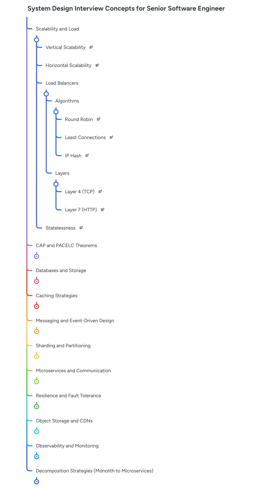

# System Design Mind Map

## System Design Topics

1. **Scalability (Vertical vs. Horizontal):** Differences between adding resources to a machine or adding more machines to the cluster, and the role of the Load Balancer in this process.

2. **Availability vs. Consistency (CAP Theorem):** How to choose between prioritizing data accuracy or system availability in the case of network partitioning.

3. **Databases (SQL vs. NoSQL):** When to use relational models (ACID) versus non-relational models (Key-Value, Document, Columnar, Graph).

4. **Caching:** Caching strategies (Read-through, Write-through, Write-back) and dump policies (LRU, LFU) at different layers (CDN, Application, DB).

5. **Messaging and Event-Driven Design:** The use of queues and Pub/Sub (Kafka, RabbitMQ) for decoupling, asynchronous processing, and resilience.

6. **Data Sharding and Partitioning:** Techniques for dividing large datasets across multiple databases to avoid bottlenecks.

7. **Microservices and Communication:** REST, gRPC, GraphQL, and the Service Discovery and API Gateway patterns.

8. **Resilience and Fault Tolerance:** Implementation of Circuit Breakers, Retries with Exponential Backoff, and Bulkheads to prevent cascading failures.

9. **File Systems and Object Storage:** When to use S3-like storage versus traditional databases for large volumes of unstructured data.

10. **Monitoring and Observability:** The importance of metrics, centralized logs, and distributed tracing to maintain system health.

11. **Refactoring Strategies (Monolith to Microservices):** Techniques for decomposition by functionality or domain (DDD), using the Strangler Fig Pattern for secure migrations.

## Topic Example

### 1. Vertical vs. Horizontal Scalability
This is the classic starting point. In an interview, it's worth mentioning not only the definition but also the practical limitations of each.

* **Vertical (Scaling Up):** Increasing the CPU/RAM of a single machine.

* **Pros:** Simplicity (doesn't require changes to the application architecture).

* **Cons:** Has a physical "ceiling" (hardware limit), cost grows exponentially, and generates a **Single Point of Failure (SPOF)**.

* **Horizontal (Scaling Out):** Adding more machine instances to the pool.

* **Pros:** Resilience (if one fails, the others follow), theoretically infinite.

* **Cons:** Requires a **stateless** architecture, load balancing, and increases network complexity.

### 2. The Role of the Load Balancer (LB)
To scale horizontally, you need an orchestrator to distribute traffic. The interviewer may ask you about distribution algorithms:

* **Round Robin:** Simple, but ignores the current load of each server.

* **Least Connections:** Sends to the least busy server (ideal for long sessions).

* **IP Hash:** Ensures that a specific user always ends up on the same server (useful if you still have "sticky sessions," although it should be avoided in modern systems).

### 3. The Statelessness Challenge
This is the "trick" for a Senior. For a system to scale horizontally infinitely, the application layer must be **stateless**.

* **Problem:** If you store the user's session in the memory of instance A, and their next request ends up on instance B via the Load Balancer, the user will be logged out.

**Solution:** Move the state outside the application. Use an external database or a distributed cache (such as Redis or Memcached) to store sessions, shopping carts, and temporary preferences.

---

**Quick Interview Scenario:**
> *"If your database becomes the bottleneck for scalability, what do you do before resorting to a complex solution like Sharding?"*

**Expected Answer:** First, optimize queries and indexes. Second, implement **Read Replicas** (read scalability). Third, add a **Caching** layer. Only then consider partitioning techniques (Sharding).

## Diagram example
